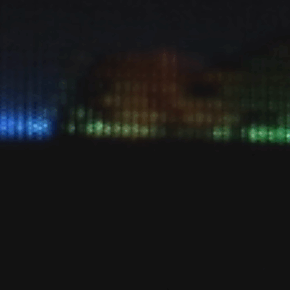
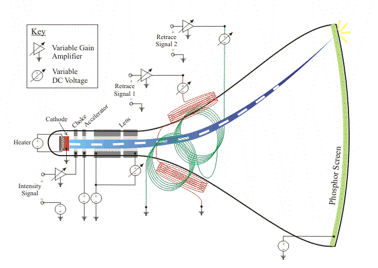
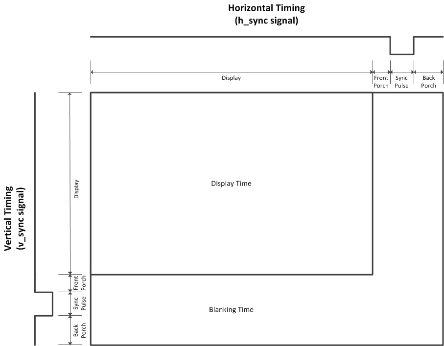
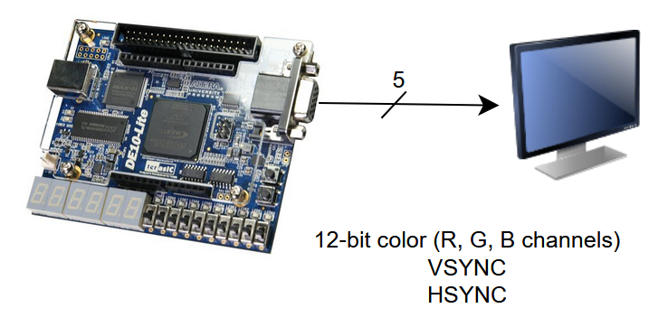
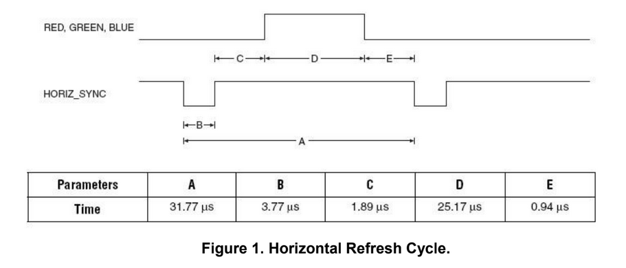
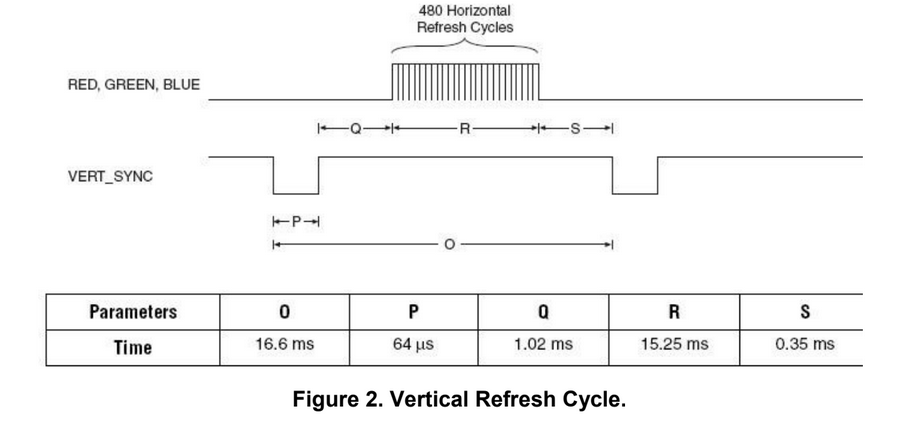
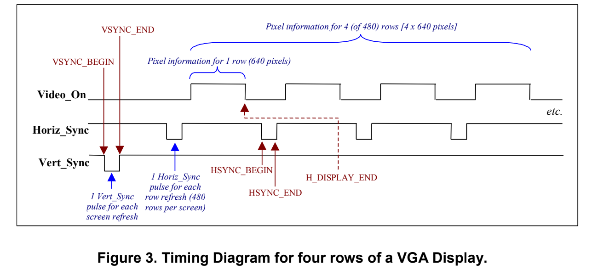
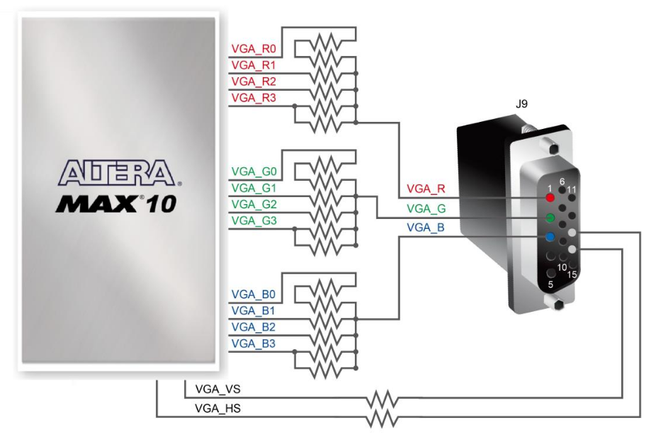
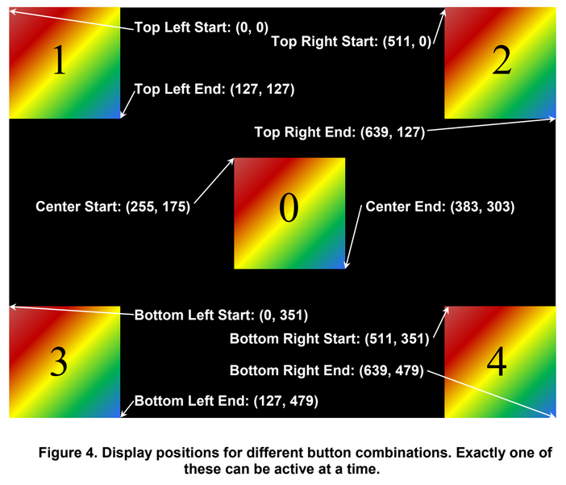

[](https://classroom.github.com/a/g5hBTZT5)
# Lab 5 - VGA Display Interface

## Objective
The objective of this lab is to study the generation of the control signals required by a VGA monitor by creating a VGA Sync Generator that generates  those signals. Using the sync generator and additional components, a simple color raster image will be displayed on a VGA monitor.

## Required Tools
- Intel Quartus Prime Lite Edition
- DE10-Lite Board
- Monitor and VGA cable (provided)
- QuestaSim

## Helpful resources
[Ben Eater Video Overview](https://www.youtube.com/watch?v=l7rce6IQDWs) - This video gives a good intuition behind what you are going to be building in this lab. It is highly recommended to watch this.

# Lab Instructions

### Notes:
- A ROM IP component will be used in this lab. You will use the Quartus IP Catalog to create this. All output bits of this lab should be directed to the appropriate pins of the DE10 VGA connector. Also, a memory initialization file (`brom.mif`) will be used to initialize the memory values of the ROM.
- When creating a Quartus project for this lab, add source files from this repository (do not copy them).
- Make sure to take a screenshot for each simulation you perform and name them according to the 'deliverables' section.
- Use the template codes provided in [src/](src/), and do not change the entity or input/output names.
- There is a header in each file that you write. You must fill it out as such:
```
Name: <student name>
Section #: <5-digit section #>
PI Name: <Name of Peer Instructor>
Description: <Short Description of file>
```

# Introduction
Video Graphics Array (VGA) is a display standard from IBM (1987) that was widely used for decades. While still in use in many older monitors, it has been replaced by HDMI and DisplayPort. It models the behavior of the older cathode ray tube (CRT) monitors. You can see how these work below:
<center>



</center>
The timing of VGA is based upon the physical process of the CRT having to 'swing' the electrons from left to right and from bottom to top. While modern monitors do not do this anymore, the standard is designed to match these timings anyways:
<center>

</center>

The display time is the time that the display is actively showing something, and the blanking time is the time it would take the electron beam to move back to the top left of the monitor.

## Technical Details
You will be creating a design that interfaces the DE10 board to a monitor via the VGA protocol.

<center>

</center>

The VGA monitor connector on the DE10 board consists of five signals: RED(4 bits), GREEN(4 bits), BLUE(4 bits), HORIZ_SYNC, and VERT_SYNC. 

### Timing
The timing relationships among this signal are shown below. The generation of signals needed for the raster on the VGA monitor begins with dividing the frequency of the 50 MHz clock on the DE10 board down to a 25 MHz pixel clock which is further divided down to the horizontal and vertical sync frequencies. This means your design will contain a horizontal counter and a vertical counter. The horizontal and vertical sync pulses of appropriate lengths are then produced from the two counters.
<center>

</center>
<center>

</center>
<center>

</center>


### Horizontal and vertical synchronization
A video display consists of 640 pixels in the horizontal direction and 480 lines of pixels in the vertical direction **(640x480)**. The monitor starts each refresh cycle by updating the pixel in the top left-hand corner of the screen, which can be treated as the origin (0,0) of a standard Cartesian plane. After the first pixel is refreshed, the monitor refreshes the remaining pixels in the row. When the monitor receives a pulse on the `HORIZ_SYNC` pin, it refreshes the next row of pixels. The time required for the sweep, the horizontal sweep period, is nominally 31.77 microseconds. This process is repeated until the monitor reaches the bottom of the screen. When the monitor reaches the bottom of the screen, a 64 *micro*second pulse applied to the `VERT_SYNC` pin causes the monitor to begin refreshing pixels at the top of the screen (i.e. at (0,0)). As shown in Figure 2, the `VERT_SYNC` pulse must be repeated every 16.6 *milli*seconds (vertical sweep period). A complete screen of information is traced by the elctron beam every 16.6 *milli*seconds for a refresh rate of 60 Hz.

### Blanking intervals
In order to accommodate the time required to move the electron beam back to the left side of the screen (horizontal retrace period), the electron beam must be turned off during the retrace time or the return trace would be visible. This is accomplished by two blaking intervals during the horizontal refresh cycle marked by B and C at the beginning of the trace and E at the end of the trace in Figure 1. Similar blanking intervals are required during vertical refresh (P, Q, and S in Figure 2). The color beams are turned on only when the horizontal counter is in the period D and the vertical counters is in period R.

*Hint*: Blanking intervals can be easily implemented by creating a video "gate" signal (video_on) that is true only when the color beams can be active. Refer to Figure 3 for a graphical look at the VGA display signals.

### DE10 Pinout for VGA
To output different colors, 12-bit color is implemented as shown below. Each color channel has 4 individual bits that are sent from the FPGA and converted into an analog voltage signal that the VGA connector can interpret. The `VGA_HS` and `VGA_VS` correspond with the horizontal and vertical sync signals respectively. To reiterate, they alone dictate the timing of when pixels are written to the monitor.
<center>

</center>


## Part 1: Pixel Clock Generator
### a) Component Design
Create a behavioral component in `part1/clk_div.vhd` to generate a 25 MHz pixel clock (Input: `clk`, Output: `pixel_clock`). You need a 25 MHz clock because the VGA interface expects a new pixel every cycle at this frequency. Use the pixel clock for every other component in this lab. DO NOT use the 50 MHz clock in any other component. Essentially, make a clock divider similar to what you did in the previous lab.

### b) Pixel Clock Testbench
Create a simple testbench `part1/clk_div_tb.vhd` that clearly shows the component you created in part 1 halving the input clock signal.

Perform a functional simulation. Take a screenshot of the functional simulation you have made and save a screenshot in `images/part1.{jpg,png}`. You do not need any 'assert' statements.

### Part 1 Deliverables
- `images/part1.{jpg,png}` - functional sim screenshot
- `src/part2/clk_div.vhd`
- `src/part2/clk_div_tb.vhd`

## Part 2: VGA Sync Generator
### a) Component Design
Create a VGA Sync Generator in the `VGA_sync_gen.vhd` file.
- Use your pixel clock generator inside of the VGA sync generator
- Some  useful constants are provided in `vga_lib.vhd`. Depending on your exact  implementation, you might need to modify these constants by a small amount. 
- Create two counters. Both counters should be declared as 10-bit std_logic/unsigned signals. 
#### Hcount 
- Continually counts up to the horizontal period (H_MAX – See vga_lib.vhd) and then starts over  at 0, using the 25 MHz pixel clock. 
- A value of zero on Hcount corresponds to the beginning of section D in Figure 1.  

#### Vcount 
- Counts up to the vertical period (V_MAX -- See `vga_lib.vhd`). It will increment at a particular  point in the horizontal counters count (Hcount = H_VERT_INC – See `vga_lib.vhd`). 
- A value of zero on Vcount corresponds to the beginning of section R in Figure 2. 
- The values of Video_On, Horiz_Sync and Vert_Sync are determined by decoding the values of Hcount and Vcount and comparing the counter values to the constants provided in `vga_lib.vhd`. 

### b) VGA Sync Generator Testbench
Create a testbench in `src/part2/VGA_sync_gen_tb.vhd` that illustrates the correct behavior and timing of all outputs. First focus your  simulations on the horizontal refresh cycle, since it can be simulated in its entirety easily. Then try to  measure the length of `VERT_SYNC` (64 μs) in simulation, and do a full simulation of the vertical refresh  cycle. Make sure the actual timings are as close as possible to the illustrated timings when using a 25  MHz clock. You can look at the final testbench in part 4 to gain some inspiration on how to set it up.

Perform a **functional** simulation of your design in Questa and save a screenshot showing the correct behavior of each VGA_sync_gen output in `images/part2b.{jpg,png}`

### Part 2 Deliverables
- `images/part2b.{jpg,png}` - functional sim screenshot
- `src/part2/VGA_sync_gen.vhd`
- `src/part2/VGA_sync_gen_tb.vhd`

## Part 3: Displaying Images
In this part of lab, you will partition the screen into 2x2 pixel-sized blocks, each of which displays a color  made from a combination or red, green, and blue. There will be a total of 4096 blocks arranged as a  64x64 grid, which forms a 128x128 image. VGA resolution is 640x480, so you must make sure the pixels  not used by the image are black. Your circuit should allow the image to be placed in five different  locations: centered (when no buttons are pressed), the top left corner (when the top left button is  pressed), the top right corner (when the top right button is pressed), etc. 

<center>

</center>

You will need to utilize three additional parts to implement this color raster picture: a ROM that contains the RGB values for each block, logic that generates the current block row, and logic that generates the current block column. They are described as follows: 

### a) Block row address logic 
This takes the Vcount signal and generates a 6-bit row address that  identifies one of the 64 rows of the 64x64 grid. The block row address will be used as a part of the address input to the ROM discussed below. Note that this logic should take into account the position of  the image based on which buttons are pressed. We recommend using an enable output that forces the  color outputs to 0 during an inappropriate row. 

### b) Block column address logic  
This takes the Hcount signal and generates a 6-bit column address that  identifies one of the 64 columns of the 64x64 grid. The block column address will be used as a part of  the address input to the ROM discussed below. Note that this logic should take into account the  position of the image based on which buttons are pressed. We recommended that you use an enable output that  forces the color outputs to 0 during an inappropriate row. 

### c) Block ROM
The ROM (BROM) contains the RGB values for each block of the 64x64 grid. Thus, the size of  ROM is 4096x12, with an 12-bit address ($2^{12} = 4096$) and a 12-bit output. You should combine the  block row and column addresses to form a 12-bit address, for which the ROM will output the RGB colors (12 bits, 4 bits each) for that block.

#### Creating the BROM Component
To generate a BROM (1-port ROM) Component, you will use the Quartus IP manager.
- Tools > IP Catalog 
- Under Basic Functions > On Chip Memory > Double click on “ROM: 1 PORT”. 
- Under the IP varation file name, add vga_rom.vhd to the filepath. You can either specify the path to be in `src/part3` or copy/paste the file for submission there.
- Specify that the output should be VHDL (if it is not checked already).  
- Click "Ok". 
On the next page of the wizard, spccify that: 
- 'q' output bus should be 12 bits. 
- There should be 4096 words. 
- Leave everything else as default. 
- Click “Next”. 
On the next page:  
- 'q' output should not be registered. 
- Leave everything else as default. 
- Click "Next" twice. 
On the next page: 
- Click "Yes, use this file for the memory content data" and specify the provided `brom.mif` file.
Leave everything else as default and finish. 
The generated file (`vga_rom.vhd`) can now be used as a component in your design. 

**IMPORTANT:** the `vga_rom` file will reference `brom.mif`. You will likely need to modify the generated code to specify the full path to `brom.mif`, since the generated code will likely use a relative path that might not be correct for your Model/QuestaSim project. 

A memory initialization file (`brom.mif`) will contain the actual memory values of the ROM and can be edited by using the Memory Editor in Quartus (or using a text editor). The provided `brom.mif`can be edited to modify the 'picture' being displayed on the VGA monitor. Using the original `brom.mif` file, you should see a color gradient changing from black on the top left corner to white on the bottom right corner.

There are some old instructions in [this document](Memory.pdf) detailing the structure of a `.MIF` file, and how you can edit the contents of it. Note that these instructions are for an old lab but are still helpful in learning how to use the on-chip memory.

### Testing
*Note:* You need to launch Model/QuestaSim through Quartus for this to work (since it is annoying to set up the Sim project with all of the proper library files).

1. Fully compile your project before oepning the simulator.
2. Launch the Sim via `Tools > Run Simulation Tool > RTL Simulation`

To check if your simulator is linked to Quartus select from the top menu `Tools > Options` then in this window that opens you’ll select EDA Tool Options and look for either ModelSim, QuestaSim, or ModelSim-ALtera to have an executable path entry. If it does, one should open when you run the RTL Simulation. If it is not, specify the executable path in one of those paths.

Design and test each part using your own test benches (simulate each component individually) to prove correctness. Perform the functional simulations and save a screenshots showing the correct behavior of each component in `images/part3a.{jpg,png}` and `images/part3b.{jpg,png}`. 

### Part 3 Deliverables
- `images/part3a.{jpg,png}` - functional sim screenshot
- `images/part3b.{jpg,png}` - functional sim screenshot
- `src/part3/col_addr_gen.vhd`
- `src/part3/row_addr_gen.vhd`
- `src/part3/col_addr_gen_tb.vhd`
- `src/part3/row_addr_gen_tb.vhd`
- `src/part3/vga_rom.vhd` - created by Quartus IP Manager

*Note*: you will probably need to move the `vga_rom.vhd` file into the correct spot for submission since it will automatically be created in the Quartus project directory.

## Part 4: Putting it all together
Create a top level VGA entity (`vga.vhd`) that connects together your VGA_sync_gen, ROM, column address logic, and row address logic to make a circuit that will display a picture as previously described. Add any additional components or logic that may be necessary (*hint*: enables to turn off pixels outside of the image). 

The top level entity has a 3 bit vector as input and generates the VGA signals as outputs. Assign the input vector to the push button switches. If the input signal is 0, show the image at the center of the  screen; if it is 1, at the top left, if 2, at the top right, if 3, bottom left, if 4, bottom right as such:

Use the provided testbench (`vga_final_tb.vhd`) to demonstrate correct timing. Take a screenshot of this succeeding and save it as `part4.jpg/png`. This testbench will generate a "vga_output.txt" inside the Model/QuestaSim folder. 

Upload the `vga_output.txt` at https://ericeastwood.com/lab/vga-simulator/, which will display the corresponding image from your simulation. (This has only been tested in Chrome). This will help verify everything is working fine. There is a tutorial video that explains how to use it here: https://www.youtube.com/watch?v=pLwiZyLRBlw

You may use one of the monitors with a VGA connector in the ECE computer lab in NEB to test out your design. This is the easiest way to check that your designs are working.

### Part 4 Deliverables
- `images/part4.{jpg,png}` - functional sim screenshot
- `src/part4/vga.vhd`
- `src/part4/vga_final_tb.vhd`

## Demo 
*Note*: all files can be found in the `src/demo` directory.
1. You will demonstrate your part 4 top-level design working.

*Tasks to complete In-Lab:*
2. You will modify your code to display a 128x128 image. Use the provided `brom128.mif` file to showcase this.
3. Use the `mif_gen.py` file to generate a MIF file for any picture that you want to display. Open up the file to see how to specify the image to convert. You will show your PI the 128x128 image of your choice on the monitor in the lab.

You **MUST** have your demo (task 1) ready before your lab is due to get credit. The other two parts will be completed in lab.

### Partial Credit
If you are unable to get the memory component working, you make implement a white box with the same pattern as in Figure 4. If you are even unable to get even this working, you can showcase a checkerboard pattern (for much less credit).

## Submission
Archive your project and save it to the root directory of this repository: `Project > Archive Project` as `<Initials>_LabX.qar`.

The last git commit _pushed_ to the main branch of the repository before the deadline will be used for grading.

Here is an example of what your repository structure could look like when you are finished with the lab:

```bash
├── <Initials>_LabX.qar
├── README.md
├── images
│   ├── part1.jpg
│   ├── part2b.jpg
│   ├── part3a.jpg
│   ├── part3b.jpg
│   └── part4.jpg
└── src
    ├── demo
    │   ├── brom128.mif
    │   └── mif_gen.py
    ├── part1
    │   ├── clk_div.vhd
    │   └── clk_div_tb.vhd
    ├── part2
    │   ├── VGA_sync_gen.vhd
    │   └── vga_tb.vhd
    ├── part3
    │   ├── brom.mif
    │   ├── col_addr_gen.vhd
    │   ├── col_addr_gen_tb.vhd
    │   ├── row_addr_gen.vhd
    │   ├── row_addr_gen_tb.vhd
    │   └── vga_rom.vhd
    ├── part4
    │   ├── vga.vhd
    │   └── vga_final_tb.vhd
    └── vga_lib.vhd
```
